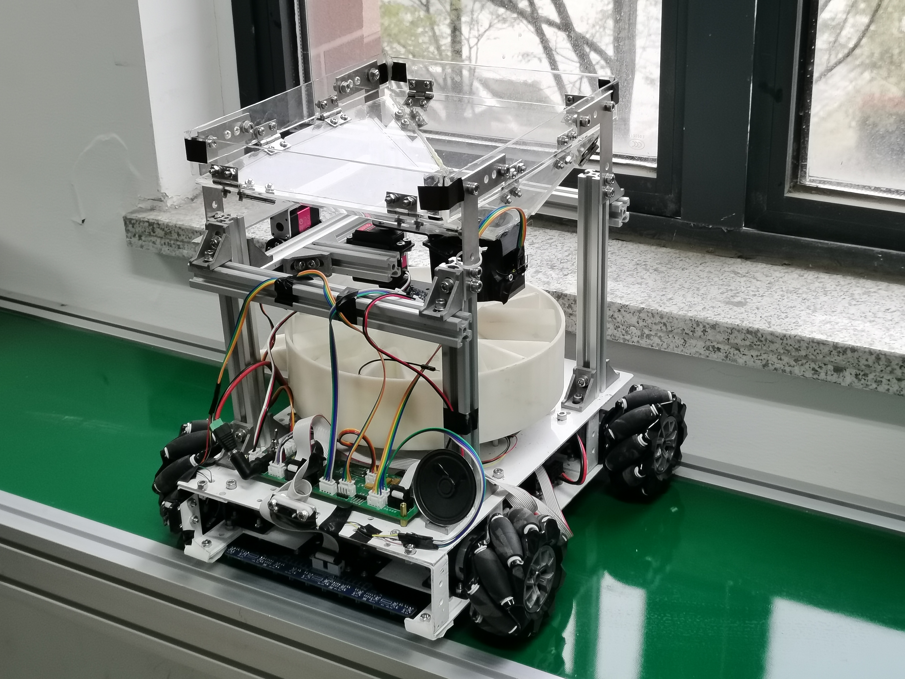
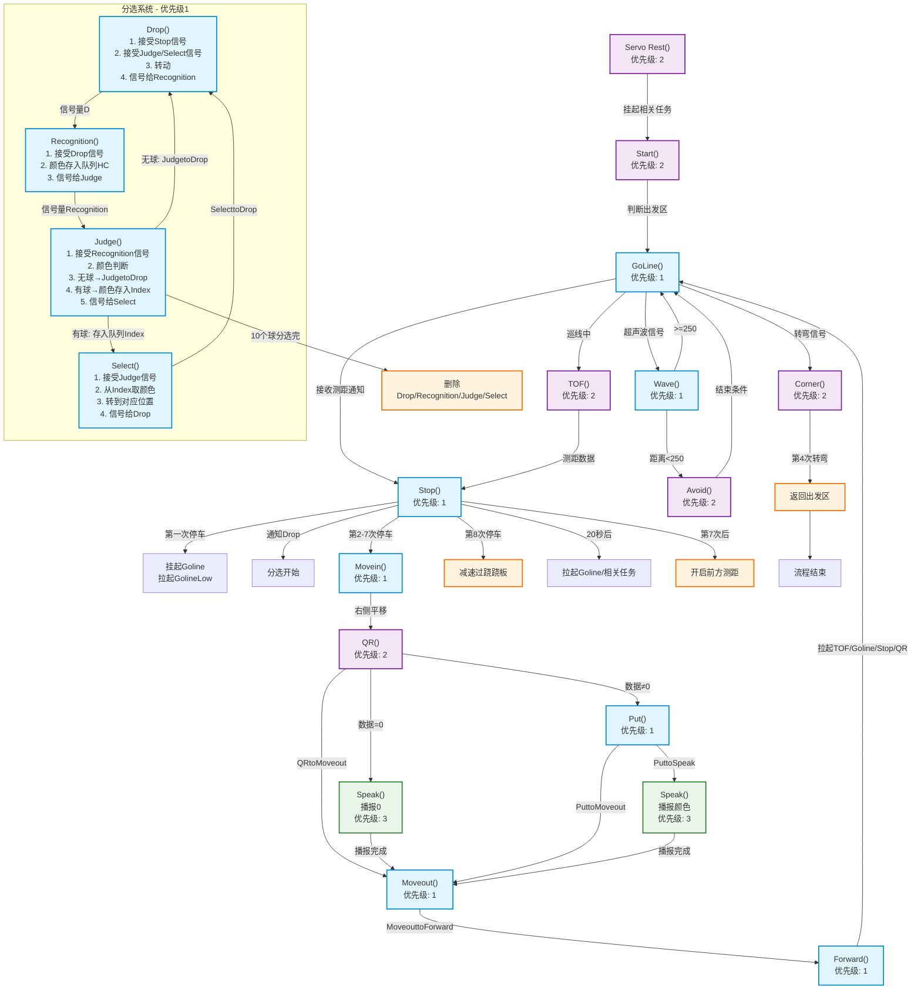

# 前言
22年赛道第一次设立，通宵达旦干了两个月，最后获得了冠军，三年过去了，忽然找到留存的资料，想起有好几个赛事群内的群友问我要过资料。虽赛事要求已发生了变化，但基本功能和逻辑一致，于是想直接开源出来，希望能帮助到参赛的同学，也希望赛事能得到更好的发展！  
时间久远，有些文件可能会有错误，欢迎指正，如果内容对你有用的话，请给个小星星⭐️！
# 介绍
PCB硬件设计部分由[@HaoKa1](https://github.com/HaoKa1)完成  
STM32控制代码部分由[@HaoKa1](https://github.com/HaoKa1)和Kaicheng Jin共同完成  
建模由Donghao Wang/Dewang Chen共同完成  

## 建模
结构使用亚克力板、铝合金板材和铝型材搭建，参考models目录下的文件
## 硬件
主控芯片选型为STM32F103RCT6，PCB元器件选型参考hardware目录下的工程文件，外设元器件参考如下，其中因主控芯片定时器数量限制，超声波测距实际上并未被使用                 
### 📡 传感模块
| 传感器类型 | 型号 | 功能 |
|:----------|:-----|:-----|
| 激光测距 | ATK-MS53L0M | 距离判断 |
| 超声波测距 | HC-SR04 | 测量距离 |
| 灰度传感器 | 得科技术 | 循迹检测 |
| 颜色识别 | TCS3472XFN | 高尔夫球颜色识别 |

### 🚀 动力模块
| 部件类型 | 型号 | 功能 |
|:--------|:-----|:-----|
| 电机驱动 | 得科技术 | 控制电机 |
| 电机 | 任意 | 驱动麦轮 |
| 麦轮 | 任意 | / |
| 舵机 | DS3220/DS3230 | 拨盘、转盘、开门 |

### 🎛️ 其他模块
| 模块类型 | 型号 | 功能 |
|:--------|:-----|:-----|
| 扫码模块 | MG65 | 识别二维码 |
| 语音播报模块 | SYN 6288 | 播报信息 |

## 软件
单片机移植FreeRTOS做状态调度，简化调度逻辑，具体流程如下
